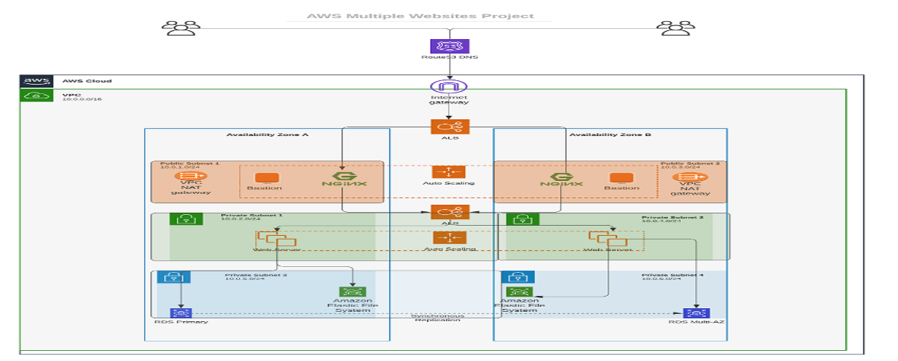
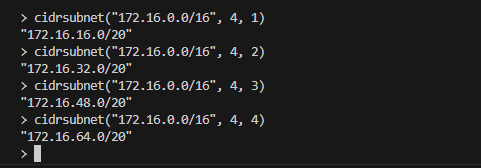
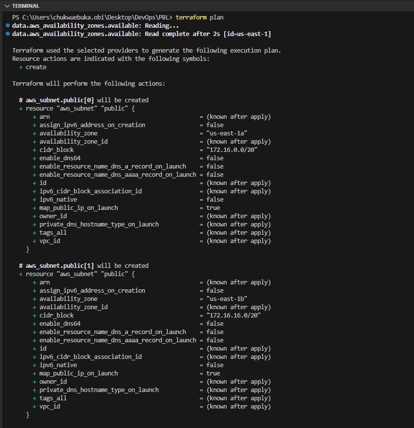
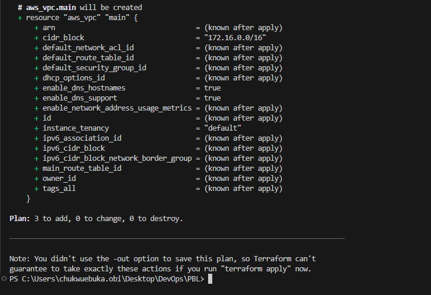
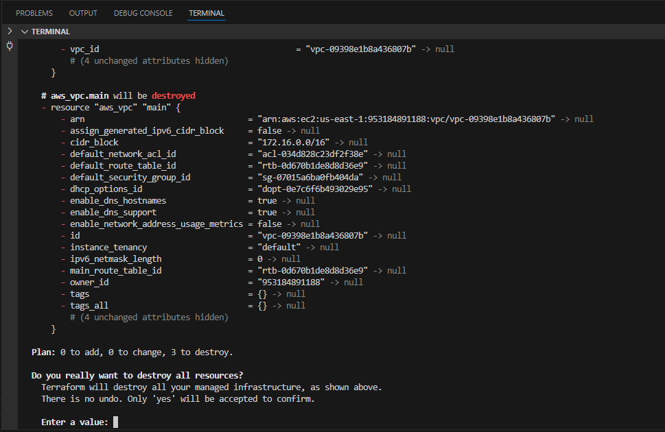

# AUTOMATING INFRASTRUCTURE WITH IaC USING TERRAFORM -- FIRST SECTION

This the automation of infrastructure, we will be using AWS, the image below is a highlight of what
we intent to achieve using Iac.



### Prerequisites before you begin writing Terraform code

- Create an IAM user named "Terraform" (we will ensure that the user only has programatic access to
  our AWS account)
- Copy and save the secret key and access key.
- We will create a S3 bucket to store Terraform state file. we can name it
  <outName>-dev-terraform-bucket

We will be using IDE VS-Code

- Lets create a folder called "PBL"
- Create a file in the folder name it main.tf
- Add AWS as a provider and a resource to create a VPC in the main.tf file
- Provider block informs Terraform that we intend to build infrastructure with AWS
- Resource block will create a VPC

```
provider "aws" {
  region = "us-east-1"
}

# Create VPC
resource "aws_vpc" "main" {
  cidr_block                     = "172.16.0.0/16"
  enable_dns_support             = "true"
  enable_dns_hostnames           = "true"
  enable_classiclink             = "false"
  enable_classiclink_dns_support = "false"
}
```

- The next thing we do is to download necessary plugins for Terraform to work. These plugins are
  used by providers and provisioners. So we will download the plugin for AWS provider. To do this we
  will run `terraform init`

- This action creates a new directory .terraform\... This is where terraform keeps plugins.

- Lets create the only resource we just defined. `aws_vpc`. But before we do that we can check to
  see if terraform intends to create before we tell it to go ahead and create it.

`terraform plan` will do this.

- When we are happy with the changes and display of what terraform intend to create we can go ahead
  and apply `terraform apply`

### Refactoring Bad Practice

From our design in the first image, we require 6 subnets.

- 2 public
- 2 private for web servers
- 2 private for data layer

With this in mind lets add the below code to our main.tf

```
# Create public subnets1
    resource "aws_subnet" "public1" {
    vpc_id                     = aws_vpc.main.id
    cidr_block                 = "172.16.0.0/24"
    map_public_ip_on_launch    = true
    availability_zone          = "us-east-1a"

}

# Create public subnet2
    resource "aws_subnet" "public2" {
    vpc_id                     = aws_vpc.main.id
    cidr_block                 = "172.16.1.0/24"
    map_public_ip_on_launch    = true
    availability_zone          = "us-east-1b"
}
```

- we are creating 2 subnets hence the two resource blocks, one for each subnet.
- We are using the vcp_id argument to interpolate the value of the VPC id by setting it to
  aws_vpc.main.id. Lets run `terraform plan` and `terraform apply`

We have two major problem with the approach above, they are hard codded values alot and multiple
resource blocks. (imagine if we want to run 100 subnets, the code sheet will be terrible)

- To fix the first issue we will refactor the code and add variables.

```
    variable "region" {
        default = "us-east-1"
    }

    variable "vpc_cidr" {
        default = "172.16.0.0/16"
    }

    variable "enable_dns_support" {
        default = "true"
    }

    variable "enable_dns_hostnames" {
        default ="true"
    }

    variable "enable_classiclink" {
        default = "false"
    }

    variable "enable_classiclink_dns_support" {
        default = "false"
    }

    provider "aws" {
    region = var.region
    }

    # Create VPC
    resource "aws_vpc" "main" {
    cidr_block                     = var.vpc_cidr
    enable_dns_support             = var.enable_dns_support
    enable_dns_hostnames           = var.enable_dns_support
    enable_classiclink             = var.enable_classiclink
    enable_classiclink_dns_support = var.enable_classiclink

    }
```

- To fix the second issue of multiple resource blocks, we use the loops and data source. We will use
  terraform functionality that spools data from our provider in this case we want to know how many
  availability zones we have available in this section.

```
        # Get list of availability zones
        data "aws_availability_zones" "available" {
        state = "available"
        }
```

- To make use of this data source we will need to introduce a count argument in the subnet block

```
    # Create public subnet1
    resource "aws_subnet" "public" {
        count                   = 2
        vpc_id                  = aws_vpc.main.id
        cidr_block              = "172.16.1.0/24"
        map_public_ip_on_launch = true
        availability_zone       = data.aws_availability_zones.available.names[count.index]

    }
```

- From the above, the count tells us that we need two subnets, therefore terraform will invoke a
  loop to create 2 subnets.
- The data source will return a list object that contains a list of AZs. Terraform will receive the
  data like below.

```
  ["eu-central-1a", "eu-central-1b"]
```

Therefore each time terraform goes into a loop to create a subnet, it must be created in the
retrieved AS from the list. Each loop will need the index number to determine what AZ the subnet
will be created. This is why we have `data.aws_availability_zones.available.names[count.index]` as
the value for availability_zone.

But we still have a problem with the cidr_block

- Let make cidr_block dynamic Using a terraform function `cidrsubnet()` we can make cidr_block
  dynamic. This function accept 3 parameters.

```
    # Create public subnet1
    resource "aws_subnet" "public" {
        count                   = 2
        vpc_id                  = aws_vpc.main.id
        cidr_block              = cidrsubnet(var.vpc_cidr, 4 , count.index)
        map_public_ip_on_launch = true
        availability_zone       = data.aws_availability_zones.available.names[count.index]

    }

```

Its parameters are ```cidrsubnet(prefix, newbits, netnum)

- The prefix parameter must be given in CIDR notation, same as for VPC
- The newbits parameters is the number of additional bits with which to extend the prefic. For
  example, if we give a prefix ending with /16 and a newbits value of 4, the result subnet will have
  a length /20
- The netnum parameter is a whole number that can be represented as a binary ineger with no more
  than newbits binary digits, which will be used to populate the additional bits added to the
  prefix.

From our terraform console we can run some cidrsubnet tests as done below.



- The final problem to solve is removing the hard coded count value.

To do this lets introduce the length() functionality. Since
`data.aws_availability_zones.available.names` returns an array list like this
`["eu-central-1a", "eu-central-1b", "eu-central-1c"]` we can pass it into length function and get
number of AZ `length(["eu-central-1a", "eu-central-1b", "eu-central-1c"])`

```
    resource "aws_subnet" "public" {
        count                   = length(data.aws_availability_zones.available.names)
        vpc_id                  = aws_vpc.main.id
        cidr_block              = cidrsubnet(var.vpc_cidr, 4 , count.index)
        map_public_ip_on_launch = true
        availability_zone       = data.aws_availability_zones.available.names[count.index]

    }
```

    What we have now seem to fix all hard code issues we had, but what if AWS returns more than 2 AZ or the length function returns 3 or more and we need just 2 subnets, how do we fix this?

- To fix this we declare a variable to store the desired number of public subnet we need.

```
  variable "preferred_number_of_public_subnets" {
      default = 2
}
```

Then we update the count argument with a condition.

```
resource "aws_subnet" "public" {
  count  = var.preferred_number_of_public_subnets == null ? length(data.aws_availability_zones.available.names) : var.preferred_number_of_public_subnets
  vpc_id = aws_vpc.main.id
  cidr_block              = cidrsubnet(var.vpc_cidr, 4 , count.index)
  map_public_ip_on_launch = true
  availability_zone       = data.aws_availability_zones.available.names[count.index]

}
```

This is a conditional statement that states: if var.preferred_number_of_public_subnets is null then
use length(data.aws_availability_zones.available.names) else use
var.preferred_number_of_public_subnets.

Our code in general becomes.

```
# Get list of availability zones
data "aws_availability_zones" "available" {
state = "available"
}

variable "region" {
      default = "eu-central-1"
}

variable "vpc_cidr" {
    default = "172.16.0.0/16"
}

variable "enable_dns_support" {
    default = "true"
}

variable "enable_dns_hostnames" {
    default ="true"
}

variable "enable_classiclink" {
    default = "false"
}

variable "enable_classiclink_dns_support" {
    default = "false"
}

  variable "preferred_number_of_public_subnets" {
      default = 2
}

provider "aws" {
  region = var.region
}

# Create VPC
resource "aws_vpc" "main" {
  cidr_block                     = var.vpc_cidr
  enable_dns_support             = var.enable_dns_support
  enable_dns_hostnames           = var.enable_dns_support
  enable_classiclink             = var.enable_classiclink
  enable_classiclink_dns_support = var.enable_classiclink

}


# Create public subnets
resource "aws_subnet" "public" {
  count  = var.preferred_number_of_public_subnets == null ? length(data.aws_availability_zones.available.names) : var.preferred_number_of_public_subnets
  vpc_id = aws_vpc.main.id
  cidr_block              = cidrsubnet(var.vpc_cidr, 4 , count.index)
  map_public_ip_on_launch = true
  availability_zone       = data.aws_availability_zones.available.names[count.index]

}
```

### Variable and tfVars

The list of variables in our main.tf file makes the whole block unable to read and dirty. We can
make things better by moving some part of the configuration content into other files.

1. We will create a new file and name it variable.tf
2. We will move the variable content to the variable.tf
3. We will create another file and call it terraform.tfvar
4. Set values for each of the variables

### main.tf

```
# Get list of availability zones
data "aws_availability_zones" "available" {
  state = "available"
}

# provider block
provider "aws" {
  profile = "default"
  region  = var.region
}

# Create VPC
resource "aws_vpc" "main" {
  cidr_block           = var.vpc_cidr
  enable_dns_support   = var.enable_dns_support
  enable_dns_hostnames = var.enable_dns_support
  #enable_classiclink             = var.enable_classiclink
  #enable_classiclink_dns_support = var.enable_classiclink

}

# Create public subnets
resource "aws_subnet" "public" {
  count                   = var.preferred_number_of_public_subnets == null ? length(data.aws_availability_zones.available.names) : var.preferred_number_of_public_subnets
  vpc_id                  = aws_vpc.main.id
  cidr_block              = cidrsubnet(var.vpc_cidr, 4, count.index)
  map_public_ip_on_launch = true
  availability_zone       = data.aws_availability_zones.available.names[count.index]

}
```

### variables.tf

```
variable "region" {
  default = "us-east-1"
}

variable "vpc_cidr" {
  default = "172.16.0.0/16"
}

variable "enable_dns_support" {
  default = "true"
}

variable "enable_dns_hostnames" {
  default = "true"
}

variable "enable_classiclink" {
  default = "false"
}

variable "enable_classiclink_dns_support" {
  default = "false"
}

variable "preferred_number_of_public_subnets" {
  default = null
}
```

### terraform.tfvars

```
region = "us-east-1"

vpc_cidr = "172.16.0.0/16"

enable_dns_support = "true"

enable_dns_hostnames = "true"

enable_classiclink = "false"

enable_classiclink_dns_support = "false"

preferred_number_of_public_subnets = 2
```

- Our tree becomes

```
└── PBL
    ├── main.tf
    ├── terraform.tfstate
    ├── terraform.tfstate.backup
    ├── terraform.tfvars
    └── variables.tf
```

Now we run `terraform plan` and `terraform play` then `terraform destroy`


##



##



##


